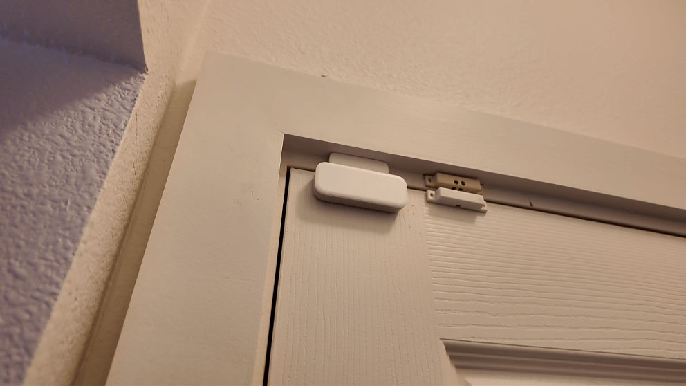
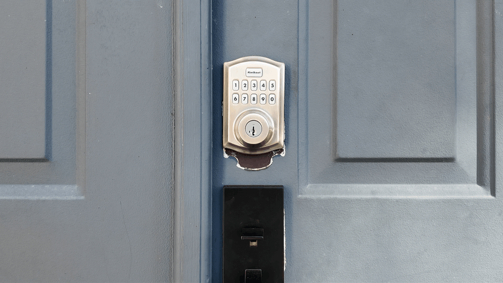
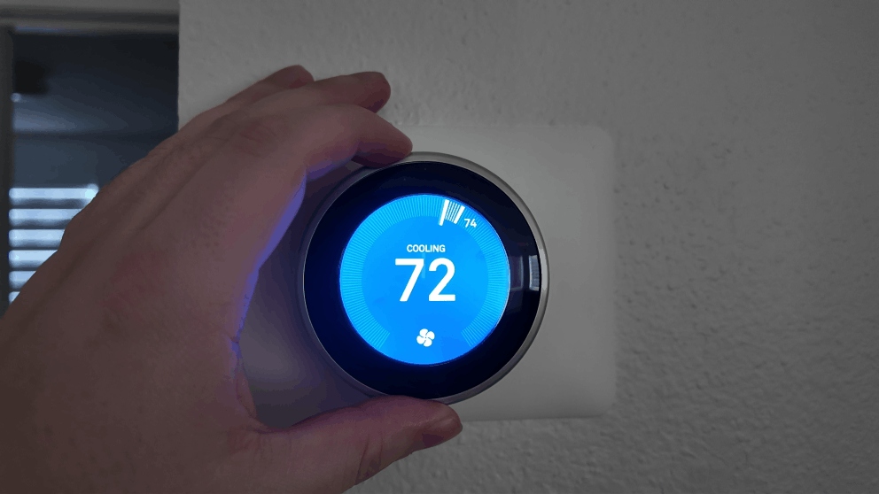
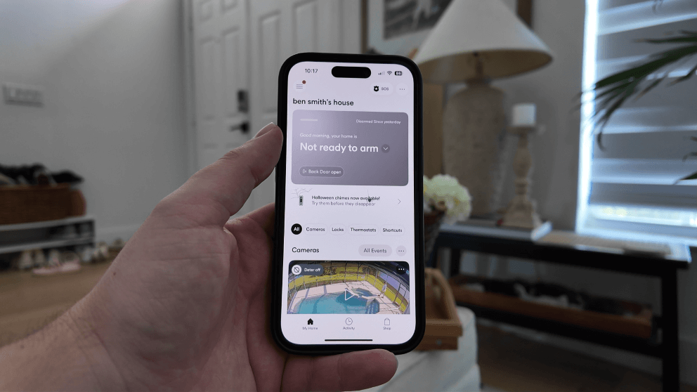

import { Image } from "astro:assets";
import vivintPanel from "../../assets/vivint/vivint-panel-3.jpg";
import vivintOutdoorCamera from "../../assets/vivint/vivint-outdoor-camera-pro-floodlight.png";
import vivintCameraZones from "../../assets/vivint/vivint-camera-zone-settings.png";
import vivintDeterMode from "../../assets/vivint/vivint-outdoor-deter-night-time-v2.png";
import vivintWirelessSensor from "../../assets/vivint/vivint-wireless-sensor.png";
import vivintSmartLock from "../../assets/vivint/vivint-smartlock.png";
import nestThermostat from "../../assets/vivint/nest-thermostat.png";
import vivintShortcuts from "../../assets/vivint/setting-up-shortcut-app.png";
import vivintApp from "../../assets/vivint/using-vivint-app.png";
import vivintLockingDoor from "../../assets/vivint/vivint-locking-door-from-app.png";
import vivintAppPoolSide from "../../assets/vivint/vivint-viewing-cameras-from-app.png";
import companyData from "../../content/companies/vivint.yaml";

<Image src={vivintAppPoolSide} alt="using the vivint app" />

I've had the Vivint home security system installed in my home for a while now, and I've been putting it through its paces. This article is going to be my complete review of the system. I've had the system for over 6 months now. So this review is based on my day-to-day use. I'll cover the equipment, the cameras, smart home features, pricing, and all the things I wish someone told me before I signed up.

If you're researching Vivint reviews and trying to figure out if this system is the right fit, I think this will help.

<CompanyRating company="vivint" />

## Pros & Cons of Vivint

Before we get I get into everything, here's a snapshot of what I like and don't like after living with this system.

<ProsCons company="vivint" />

## What is Vivint?

Vivint is a professionally installed home security system with smart home automation built in. They've been around since 1999 (originally called APX Alarm Security Solutions) and rebranded to Vivint in 2011. Today they're one of the bigger names in the home security space, and they focus on smart home security.

What separates Vivint from companies like SimpliSafe or Ring is that everything is professionally installed and managed under one roof. The panel, app, cameras, montoring, nearly everything is done in house. This means that the equipment is designed to work with on another providing a seamless user experience.

<strong>> > Vivint Promo:</strong> <a href={companyData.website}>{companyData.promo}</a> or call <a href={`tel:${companyData.phoneUnformatted}`}>{companyData.phone}</a>

## The Vivint Smart Hub Panel

<figure>
  <Image src={vivintPanel} alt="Vivint Smart Hub Panel" />
  <figcaption>
    The Vivint Smart Hub panel is touchscreen making is a breeze to use and
    change settings.
  </figcaption>
</figure>

The smart hub panel is the brain of the whole system. It's a touchscreen panel that you can use to arm and disarm the alarm, control your smart home devices, view camera feeds, and change settings.

I really like the touchscreen compared to the traditional push-button keypads you see with older alarm systems. It's way more intuitive. Changing a PIN code, bypassing a sensor, adjusting settings, it's all just easier when you can tap through menus on a screen. If you've used a tablet, you can use this panel.

The panel also doubles as a communication hub. When I accidentally set the alarm off (it happens), the monitoring center called within seconds. They can talk to you through the panel itself, which would be useful during an actual emergency if you can't get to your phone.

That said, I'll be honest: I rarely use the panel. The app handles 99% of what I need to do, and it's just more convenient to pull out my phone than walk over to the panel. More on the app in a minute.

<Admonition>
  <strong>Pro Tip: </strong>If you accidentally trigger the alarm and disarm it
  within a few seconds, it cancels any dispatch. Most of the time, the
  monitoring company won't even call because they can tell it was a false alarm.
  That was one of my biggest concerns going in, and it turned out to not be an
  issue.
</Admonition>

## Vivint Cameras Review

<figure>
  <Image
    src={vivintOutdoorCamera}
    alt="Vivint Outdoor Camera with Floodlight"
  />
  <figcaption>
    The Vivint Outdoor Camera Pro with the floodlight add-on installed outside
    my house.
  </figcaption>
</figure>

The cameras are my favorite part of the system and the feature I use the most. I have the doorbell camera and the outdoor camera installed. I later upgraded the outdoor camera with the floodlight add-on, which I'd recommend if your budget allows for it.

The types of cameras Vivint offers are:

- Inside Camera
- Doorbell Camera
- Outside Camera

### Vivint Camera Features Overview

| Feature                          | Indoor Camera     | Doorbell Camera       | Outdoor Camera       |
| -------------------------------- | ----------------- | --------------------- | -------------------- |
| Resolution                       | 1080p HD          | 4k                    | 4k                   |
| Night Vision                     | Yes               | Yes                   | Yes                  |
| Two-Way Talk                     | Yes               | Yes                   | Yes                  |
| Weather Resistant                | No                | Yes                   | Yes                  |
| Motion Detection Zones           | Yes               | Yes                   | Yes                  |
| Smart Deter (red ring + whistle) | No                | Yes                   | Yes                  |
| Floodlight Option                | No                | No                    | Yes (add-on)         |
| Package Detection                | No                | Yes                   | No                   |
| 24/7 Recording                   | Yes               | Yes                   | Yes                  |
| Best For                         | Indoor monitoring | Front door & visitors | Exterior & perimeter |

Both cameras have really good video quality. Everything comes through detailed and clear during the day, and the night vision is solid too. Even when it's pitch black outside, I can still make out faces and details. They also have two-way talk, so you can speak to whoever is at your door (or lurking in your yard) directly from your phone or the panel.

The cameras connect wirelessly to the panel, which acts as a local DVR. So even if your WiFi goes down, the cameras keep recording. You just won't be able to view them remotely from your phone until the WiFi comes back.

Now, "wireless" is a bit misleading. The cameras still need to be plugged into a power outlet. The exception is the doorbell camera, which can use existing doorbell wiring if you have it. My original doorbell wasn't working when I bought the house, so the tech drilled a small hole and ran wiring to a nearby outlet. I was even able to hide the cable behind the baseboard, so you can't see it at all. The install turned out great.

<strong>> > Vivint Promo:</strong> <a href={companyData.website}>{companyData.promo}</a> or call <a href={`tel:${companyData.phoneUnformatted}`}>{companyData.phone}</a>

### Detection Zones and Alerts

<figure>
  <Image src={vivintCameraZones} alt="Vivint Camera Detection Zone Settings" />
  <figcaption>
    I recommend adjusting the detection zones in the app in order to prevent
    false notifications.
  </figcaption>
</figure>

When I first set up the cameras, I was getting way too many alerts. Every car driving by, every shadow, everything was setting them off. I had to spend some time adjusting the detection zones and sensitivity settings. Once I dialed it in, the false alerts dropped significantly. Now I rarely get a notification unless someone is actually there.

When the camera detects activity, you get a push notification on your phone and the camera starts recording. You can view all your recorded clips in the events tab. The oldest footage auto-deletes as new recordings come in, and it stores roughly 14 days of video depending on how much activity your cameras pick up.

There's also an option for continuous 24/7 recording where the cameras record all the time, not just when motion is detected. It gives you a timeline view with markers where events occurred, and you can scrub through the last 10 days of footage. That costs an extra $7 per month.

### The Deter Feature

<figure>
  
  <figcaption>The outdoor camera in deter mode at night.</figcaption>
</figure>

This is one of Vivint's more unique features. When you put the camera into deter mode, the lens lights up with a red ring and the camera whistles at anyone it detects. The idea is that a potential intruder sees the red light, hears the whistle, and looks straight at the camera. So even if they don't leave, you've got a clear shot of their face.

Both cameras have this feature, but the outdoor camera takes it further with the floodlight. In deter mode, if someone walks up to the house, the floodlight turns on, the camera whistles, and that red ring glows. It's a lot of stimulus all at once. I think it would genuinely freak someone out if they weren't expecting it.

## Vivint Sensors

<figure>
  
  <figcaption>Wireless Vivint sensor compared to a wired sensor.</figcaption>
</figure>

There isn't a ton to say about the sensors because they just work, and that's exactly what you want. I have sensors on all the doors and windows plus two glass break sensors.

My house had an older hardwired alarm system when I moved in, so Vivint was able to take over a lot of those existing sensors. For the ones that weren't working anymore, we replaced them with Vivint's wireless sensors. Everything has worked without issues.

When your tech comes out, they'll customize the sensor placement based on your home's layout. Every house is different, so it's nice that they walk the property and figure out the best spots rather than just sticking sensors wherever.

Vivint also offers smoke and CO detectors, water sensors, and emergency pendants if you need those.

<strong>> > Vivint Promo:</strong> <a href={companyData.website}>{companyData.promo}</a> or call <a href={`tel:${companyData.phoneUnformatted}`}>{companyData.phone}</a>

## Smart Home Features

The smart home integration was one of the main reasons I went with Vivint over a more basic system. Right now I have the door lock and the Nest thermostat connected, with plans to add more down the road.

### Door Lock

<figure>
  
  <figcaption>
    You can control it from the doorlock from the app, the panel, or the keypad
    on the lock itself.
  </figcaption>
</figure>

The door lock can be controlled from the app, the panel, or with a keypad on the lock itself. Each person in the house gets their own PIN code, and you can change PIN codes remotely from the app. That's pretty useful if you're renting the house out on Airbnb or need to give temporary access to someone. And if the battery dies, you can still use your physical key like normal, so you're never locked out.

<Admonition>
  <strong>Helpful Tip:</strong> When they installed my new smart lock, they were
  able to use the same key from my original door lock. So I didn't have to worry
  about carrying a new key.
</Admonition>

### Thermostat

<figure>
  
  <figcaption>
    The Nest thermostat connects to the Vivint system. It adjusts temperature
    based on whether you're home or away.
  </figcaption>
</figure>

We use the Nest thermostat, which has a built-in motion sensor that tries to detect whether you're home and adjusts the temperature to save energy. Since it's tied into Vivint, it also knows when you arm and disarm the system, so it has a better idea of when you're actually away versus just in another room.

Vivint advertises that it should save you 10-15% on your electric bill. I'm going to be honest, I can't confirm that number because I got it installed shortly after moving in and don't have a baseline to compare against. But the concept makes sense, and I haven't had any complaints about how it works.

### Automations and Shortcuts

<figure>
  
  <figcaption>Setting up automations in the Vivint app is a breeze.</figcaption>
</figure>

The app has a shortcuts feature where you can set up automations. For example, when I lock the front door, the system automatically arms. Or you could set it up so that after 9 PM, arming the system also turns off the lights, locks the doors, and adjusts the temperature.

You set a trigger (time of day, an event like opening a door, arming the system, ringing the doorbell) and then define a series of actions that fire when that trigger is met. There are a lot of options to play with.

I personally don't use this feature as much as I could, but if you're the type of person who wants to turn your house into a true smart home, there's a lot of depth here. Vivint also supports Z-Wave compatible devices, so you can connect things like Z-Wave light switches and control them through the same app.

## The Vivint app

<figure>
  
  <figcaption>
    The Vivint mobile app home screen. Hands down the easiest to use app.
  </figcaption>
</figure>

This is where the system really shines, and it's where I spend almost all of my time managing the system. From the app, I can:

- Arm and disarm the alarm
- Lock and unlock the door
- Watch camera feeds and view recordings
- Change the temperature
- Set up automations
- Download video clips

The interface is clean and puts your camera feeds front and center. I didn't experience any lag or slow loading when checking cameras, which is something that bugged me with other systems I've tried.

There's something really nice about having everything consolidated under one app. I know you can Frankenstein together a smart home system with a mix of Ring cameras, a Nest thermostat, Smart locks, and a dozen different apps. But managing all of that through a single interface is genuinely convenient. I've lost count of how many times I've left the house, wondered if I locked the door, and just pulled up the app to check.

<figure>
  
  <figcaption>Locking my front door using the app.</figcaption>
</figure>

## Vivint Monitoring

Vivint's monitoring covers police, fire, and medical. It's all handled through a cellular connection with WiFi as a secondary path. The panel has a backup battery, so even during a power outage, you're still covered.

I've never had a real break-in (thankfully), but I have accidentally set off the alarm a handful of times. The response has always been fast. Within seconds, they're calling my phone. If you don't answer, they try to reach you through the panel. And if they still can't reach you, they dispatch authorities.

One thing worth knowing: if you accidentally trigger the alarm and quickly disarm it, the system is smart enough to cancel the dispatch on its own. That put my mind at ease early on because I was worried about the police showing up because I forgot my own alarm was on.

<Admonition>
  <strong>Pro Tip:</strong> Vivint offers a duress code feature. If someone
  forces you to disarm your system, you can enter the duress code instead of
  your normal PIN. It will appear to disarm, but Vivint's monitoring center will
  listen in for 30 seconds and dispatch authorities if they hear suspicious
  activity.
</Admonition>

## Vivint Pricing and Packages

Let's talk money, because this is where Vivint gets some criticism. And honestly, some of it is fair.

### Monthly monitoring costs

| Plan             | Cost                | What's Included                               |
| ---------------- | ------------------- | --------------------------------------------- |
| Basic Monitoring | $29.99/month        | Police, fire, medical monitoring plus the app |
| Smart Home       | $39.99/month        | Monitoring plus smart home features           |
| Camera Add-on    | $5/month per camera | Each camera added on top of your plan         |

So for my system with monitoring, smart home, and two cameras, I'm paying about $49 per month. That's not cheap compared to something like Ring ($20/month) or SimpliSafe ($29.99/month), but you're getting professional monitoring, smart home automation, and everything tied together.

### Equipment costs

Equipment starts at around $599 and goes up from there depending on what you add. I paid somewhere around $1,200-$1,300 for my whole setup, which included the panel, doorbell camera, outdoor camera, door lock, thermostat, and sensors.

Here's the part that I think is really important: **Vivint gives you the option to pay for equipment upfront.** That's what I did, and it means my service is month-to-month with no contract. I can cancel whenever I want without owing anything.

The alternative is to finance the equipment at 0% interest over 42 or 60 months. Vivint rolls that cost into your monthly bill, so you're paying one amount each month that covers service plus equipment. It's similar to how cell phone plans work. But here's the catch: if you finance, you're locked into a service agreement. You can't cancel the monitoring without also paying off the equipment balance. You can't just walk away from the service and keep making payments on the equipment separately.

If you can swing the upfront cost, I'd recommend it. The freedom of month-to-month service without a contract is worth it.

### Trial period and warranty

Vivint offers a 14-day trial period, which is shorter than the 30-day window most competitors offer. The equipment is warrantied as long as you have service with them.

## Installation experience

Vivint only does professional installation, and it's included at no extra charge with your monitoring plan. A technician comes out, walks your property, asks where you want cameras placed, and handles everything. The whole process took a couple of hours for my system.

The tech did a great job. They were professional, explained how everything worked, and cleaned up after themselves. The camera installations turned out clean, especially the doorbell camera where they had to run wiring. I was genuinely impressed with how it looked when they were done.

There's no DIY option with Vivint, which might be a dealbreaker if you want to do it yourself. But if you prefer having someone else handle it, it's a smooth experience. You don't have to do anything except be home.

## Customer service

I've seen a lot of complaints about Vivint's customer service online, so I want to share my experience. Whenever I've called in, I've gotten a US-based agent and the experience has been fine. Not amazing, not terrible. Normal customer service. I've never had billing issues.

The one thing I will say is to avoid the website chat. Every time I've tried to use it, I get connected to an overseas rep who can't really help. Just call. It's faster and you'll actually get your issue resolved.

## What I'd do differently

After living with this system, there are a few things I'd change if I were starting over:

**I'd think harder about how many cameras I actually need.** At $5/month per camera on top of the monitoring fee, plus the upfront cost of the cameras themselves, they add up fast. If you really just want cameras, there are cheaper options out there. Where Vivint makes sense is if you want the full security system with smart home features and you want a couple cameras to go with it.

**I'd invest more into smart home automation** There is so much more that you can do with the system than what I have. I would have invested more into smart lighting and other z-wave compatiable devices since they can all be connect to the Vivint app.

## Who is Vivint good for?

Vivint is a good fit if you:

- Want a fully integrated system where security, cameras, and smart home all live in one app
- Prefer professional installation over DIY
- Value smart home automation (door locks, thermostats, automations, Z-Wave support)
- Don't mind paying a premium for a polished experience

Vivint is probably not for you if you:

- Are on a tight budget
- Only want cameras and don't need a full security system
- Want DIY installation
- Don't want to deal with a sales call to get a quote

## Is Vivint worth it?

Vivint is worth it to those who want all the bells and whistles. I like that everything works together under one app, the cameras are solid, the monitoring response time is fast, and the smart home features add real convenience to my routine. The design and build quality of the equipment is a step above most competitors.

But "worth it" depends on what you value. If you're the kind of person who wants everything dialed in and is willing to pay for that convenience, Vivint delivers. If you're more of a "I just need something basic to cover the doors and windows" person, you'll be overpaying for features you won't use.

The cameras being proprietary is still my biggest gripe. For the price you pay, it would be nice if they worked independently of the Vivint service. But that's the trade-off with a closed ecosystem.

So, if you're interested in getting a qoute, you can <a href={companyData.website}>visit their website</a> or give them a call at <a href={`tel:${companyData.phoneUnformatted}`}>{companyData.phone}</a>

<FAQ
  items={[
    {
      question: "Is Vivint a good security system?",
      answer:
        "Yes. Vivint offers professional monitoring, high-quality cameras, and one of the best smart home integrations in the industry. The equipment is solid and the app is well-designed. The main downside is the cost, which is higher than most competitors.",
    },
    {
      question: "How much does Vivint cost per month?",
      answer:
        "Vivint's monitoring starts at $29.99/month for basic service (police, fire, medical plus the app). Adding smart home features brings it to $39.99/month. Each camera adds $5/month on top of that. Equipment costs start around $599 if you pay upfront.",
    },
    {
      question: "Is Vivint worth the money?",
      answer:
        "Vivint has all the features one could want in a smart home security system. Not everyone needs every bell and whistle though. If you're on a budget or just need basic security, there are more affordable options like SimpliSafe or Ring.",
    },
    {
      question: "Does Vivint require a contract?",
      answer:
        "Not if you pay for the equipment upfront. In that case, the service is month-to-month and you can cancel anytime. If you finance the equipment, you're locked into a service agreement for the length of the financing term (42 or 60 months).",
    },
    {
      question: "Can I use Vivint cameras without the service?",
      answer:
        "Technically yes, but only locally. Without the service, cameras will still record to your panel, but you won't have access to the app, remote viewing, or cloud storage. You'd have to physically go to the panel to watch any recordings.",
    },
    {
      question: "How does Vivint monitoring work?",
      answer:
        "Vivint uses 24/7 professional monitoring through a cellular connection with WiFi backup. When an alarm triggers, you receive an alert and the monitoring center contacts you. If they can't reach you, they dispatch police, fire, or medical depending on the alarm type.",
    },
    {
      question: "Does Vivint work with Alexa and Google Assistant?",
      answer:
        "Yes. Vivint integrates with both Amazon Alexa and Google Assistant. You can use voice commands to arm the system, control smart lights, adjust thermostats, and view camera feeds on Echo Show or Google Nest Hub devices.",
    },
  ]}
/>
