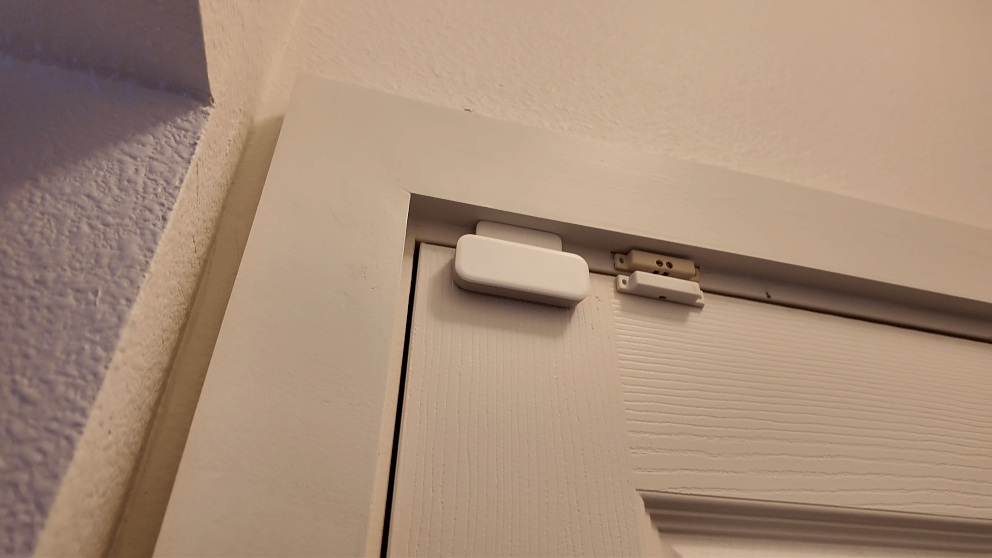
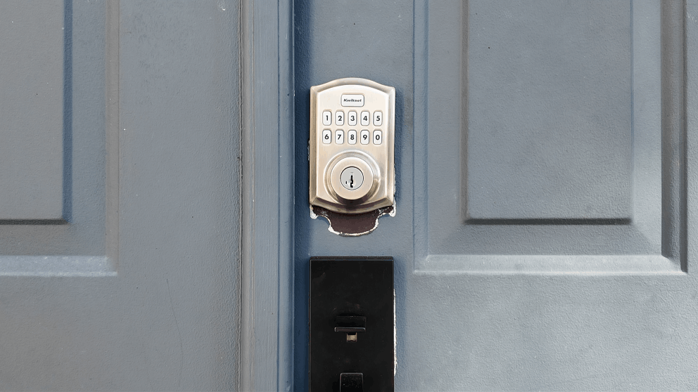
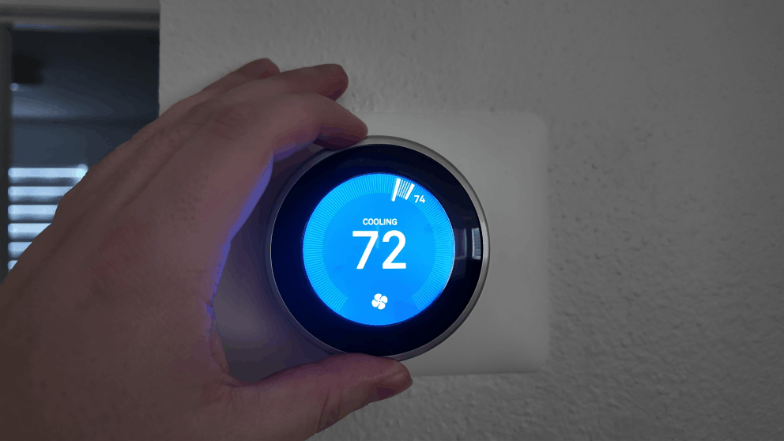
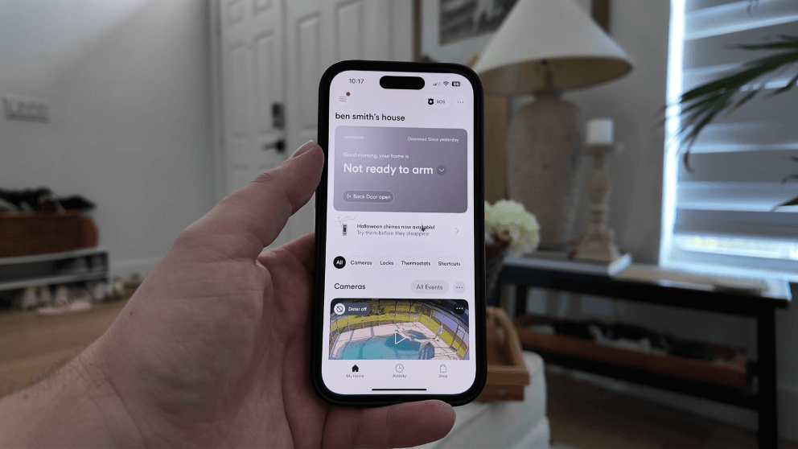

import { Image } from "astro:assets";
import vivintPanel from "../../assets/vivint/vivint-panel-3.jpg";
import vivintOutdoorCamera from "../../assets/vivint/vivint-outdoor-camera-pro-floodlight.png";
import vivintCameraZones from "../../assets/vivint/vivint-camera-zone-settings.png";
import vivintDeterMode from "../../assets/vivint/vivint-outdoor-deter-night-time-v2.png";
import vivintWirelessSensor from "../../assets/vivint/vivint-wireless-sensor.png";
import vivintSmartLock from "../../assets/vivint/vivint-smartlock.png";
import nestThermostat from "../../assets/vivint/nest-thermostat.png";
import vivintShortcuts from "../../assets/vivint/setting-up-shortcut-app.png";
import vivintApp from "../../assets/vivint/using-vivint-app.png";
import vivintLockingDoor from "../../assets/vivint/vivint-locking-door-from-app.png";
import vivintAppPoolSide from "../../assets/vivint/vivint-viewing-cameras-from-app.png";
import companyData from "../../content/companies/vivint.yaml";

<Image src={vivintAppPoolSide} alt="using the vivint app" />

I've had the Vivint home security system installed in my home for a while now, and I've been putting it through its paces. This vivint home security review is based on over 6 months of day-to-day use. I'll cover the equipment, the video quality, professional monitoring, pricing, and all the things I wish someone told me before I signed up.

If you're researching home security systems and trying to figure out if Vivint is the right fit, I think this will help. I'll give you an honest look at what works, what doesn't, and whether this security system is worth the investment.

<CompanyRating company="vivint" />

## Pros & Cons of Vivint

Before I get into everything, here's a snapshot of what I like and don't like after living with this system.

<ProsCons company="vivint" />

## What is Vivint?

Vivint is a professionally installed home security system with automation built in. They've been around since 1999 (originally called APX Alarm Security Solutions) and rebranded to Vivint in 2011. Today they're one of the bigger names in the home security industry, and they focus on building a quality home security option that combines monitoring, video surveillance, and home automation into one platform.

What separates Vivint from companies like SimpliSafe or Ring is that everything is professionally installed and managed under one roof. The smart hub, app, outdoor camera, indoor camera, doorbell, monitoring — nearly everything is done in house. This means that the Vivint security equipment is designed to work together providing a seamless user experience. Is Vivint a good company? Based on my time with the system, I'd say yes — but with some caveats that I'll explain throughout this review.

<strong>> > Vivint Promo:</strong> <a href={companyData.website}>{companyData.promo}</a> or call <a href={`tel:${companyData.phoneUnformatted}`}>{companyData.phone}</a>

## The Vivint Smart Hub Panel

<figure>
  <Image src={vivintPanel} alt="Vivint Smart Hub Panel" />
  <figcaption>
    The Vivint Smart Hub panel is touchscreen making is a breeze to use and
    change settings.
  </figcaption>
</figure>

The smart hub is the brain of the whole Vivint system. It's a touchscreen panel that you can use to arm and disarm the alarm, control your devices, view camera feeds, and change settings. It acts as the central command center — every sensor, camera, and connected device ties back to it.

I really like the touchscreen compared to the traditional push-button keypads you see with older security systems. It's way more intuitive. Changing a PIN code, bypassing a sensor, adjusting settings — it's all just easier when you can tap through menus on a screen. If you've used a tablet, you can use the smart hub without any learning curve.

The hub also doubles as a communication device. When I accidentally set the alarm off (it happens), the monitoring center called within seconds. They can talk to you through the panel itself, which would be useful during an actual emergency if you can't get to your phone. It has a built-in speaker and microphone, so the monitoring team can communicate directly with you or anyone in the house.

One thing I appreciate about the smart hub is that it shows you _everything_ at a glance — which doors and windows are open, whether the system is armed, and live feeds from your video devices. It's essentially a control center mounted on your wall.

That said, I'll be honest: I rarely use the panel day-to-day. The app handles 99% of what I need to do, and it's just more convenient to pull out my phone than walk over to it. More on the app in a minute.

<Admonition>
  <strong>Pro Tip: </strong>If you accidentally trigger the alarm and disarm it
  within a few seconds, it cancels any dispatch. Most of the time, the
  monitoring company won't even call because they can tell it was a false alarm.
  That was one of my biggest concerns going in, and it turned out to not be an
  issue.
</Admonition>

## Vivint Camera and Video Review

<figure>
  <Image
    src={vivintOutdoorCamera}
    alt="Vivint Outdoor Camera with Floodlight"
  />
  <figcaption>
    The Vivint Outdoor Camera Pro with the floodlight add-on installed outside
    my house.
  </figcaption>
</figure>

The cameras are my favorite part of the Vivint system and the feature I use the most. I have the doorbell camera and the outdoor camera installed. I later upgraded the outdoor camera with the floodlight add-on, which I'd recommend if your budget allows for it.

Vivint offers three types of cameras for their security system:

- Inside Camera
- Doorbell Camera
- Outside Camera

### Vivint Camera Features Overview

| Feature                          | Indoor Camera     | Doorbell Camera       | Outdoor Camera       |
| -------------------------------- | ----------------- | --------------------- | -------------------- |
| Resolution                       | 1080p HD          | 4k                    | 4k                   |
| Night Vision                     | Yes               | Yes                   | Yes                  |
| Two-Way Talk                     | Yes               | Yes                   | Yes                  |
| Weather Resistant                | No                | Yes                   | Yes                  |
| Motion Detection Zones           | Yes               | Yes                   | Yes                  |
| Smart Deter (red ring + whistle) | No                | Yes                   | Yes                  |
| Floodlight Option                | No                | No                    | Yes (add-on)         |
| Package Detection                | No                | Yes                   | No                   |
| 24/7 Recording                   | Yes               | Yes                   | Yes                  |
| Best For                         | Indoor monitoring | Front door & visitors | Exterior & perimeter |

Both the doorbell and outdoor cameras have really good video quality. Everything comes through detailed and clear during the day, and the night vision is solid too. Even when it's pitch black outside, I can still make out faces and details. The resolution on the outdoor camera and doorbell is 4K, which is a step above what most security systems offer. They also have two-way talk, so you can speak to whoever is at your door (or lurking in your yard) directly from your phone or the panel.

The cameras connect wirelessly to the smart hub, which acts as a local DVR. So even if your WiFi goes down, the system keeps recording locally. You just won't be able to view the footage remotely from your phone until the WiFi comes back.

Now, "wireless" is a bit misleading. Each camera still needs to be plugged into a power outlet. The exception is the doorbell camera, which can use existing doorbell wiring if you have it. My original doorbell wasn't working when I bought the house, so the tech drilled a small hole and ran wiring to a nearby outlet. I was even able to hide the cable behind the baseboard, so you can't see it at all. The install turned out great.

<strong>> > Vivint Promo:</strong> <a href={companyData.website}>{companyData.promo}</a> or call <a href={`tel:${companyData.phoneUnformatted}`}>{companyData.phone}</a>

### Camera Zones and Alerts

<figure>
  <Image src={vivintCameraZones} alt="Vivint Camera Detection Zone Settings" />
  <figcaption>
    I recommend adjusting the detection zones in the app in order to prevent
    false notifications.
  </figcaption>
</figure>

When I first set up the system, I was getting way too many alerts from the outdoor camera. Every car driving by, every shadow — everything was setting off the motion sensing. I had to spend some time adjusting the zones and sensitivity settings in the app. Once I dialed it in, the false alerts dropped significantly. Now I rarely get a notification unless someone is actually there.

When motion is detected, you get a push notification on your phone and the camera starts recording. You can view all your recorded clips in the events tab. The oldest footage auto-deletes as new recordings come in, and it stores roughly 14 days of footage depending on how much activity the cameras pick up.

There's also an option for continuous 24/7 recording where the cameras record all the time, not just when motion is detected. It gives you a timeline view with markers where events occurred, and you can scrub through the last 10 days of footage. That costs an extra $7 per month. If you have multiple cameras, each one adds to that monthly cost, so keep that in mind when planning your setup.

### The Deter Feature

<figure>
  
  <figcaption>The outdoor camera in deter mode at night.</figcaption>
</figure>

This is one of Vivint's more unique features. When you put the camera into [deter mode](/home-security-systems/what-is-deter-mode-on-vivint/), the lens lights up with a red ring and the camera whistles at anyone it detects. The idea is that a potential intruder sees the red light, hears the whistle, and looks straight at the camera. So even if they don't leave, you've got a clear shot of their face.

Both the doorbell and the Vivint outdoor camera pro have this feature, but the outdoor unit takes it further with the floodlight. In deter mode, if someone walks up to the house, the floodlight turns on, the camera whistles, and that red ring glows. It's a lot of stimulus all at once. I think it would genuinely freak someone out if they weren't expecting it. This kind of proactive deterrence is something you don't get with most security systems.

## Vivint Sensors

<figure>
  
  <figcaption>Wireless Vivint sensor compared to a wired sensor.</figcaption>
</figure>

There isn't a ton to say about the sensors because they just work, and that's exactly what you want from a home security system. I have sensors on all the doors and windows plus two glass break sensors. The system has been super reliable — I haven't had a single false trigger from any of the sensors in over six months.

My house had an older hardwired alarm system when I moved in, so Vivint was able to take over a lot of those existing sensors. For the ones that weren't working anymore, we replaced them with Vivint's wireless sensors. Everything has worked without issues. The wireless sensors are small and blend into the door frame, so they're not an eyesore.

When your tech comes out, they'll customize the sensor placement based on your home's layout. Every house is different, so it's nice that they walk the property and figure out the best spots rather than just sticking sensors wherever. This is one of the advantages of professional installation over a DIY security system — the technician knows the optimal placement for detection coverage.

Vivint also offers **smoke and CO detectors**, water sensors, and emergency pendants if you need those. The smoke and CO detectors tie into the monitoring service, so the response center is automatically alerted if one goes off. That's a feature that gives real peace of mind, especially if you travel often or have elderly family members in the home.

<strong>> > Vivint Promo:</strong> <a href={companyData.website}>{companyData.promo}</a> or call <a href={`tel:${companyData.phoneUnformatted}`}>{companyData.phone}</a>

## Vivint Smart Home Features

Smart home integration was one of the main reasons I went with Vivint over a more basic system. Right now I have the door lock and the Nest thermostat connected, with plans to add more down the road.

### Door Lock

<figure>
  
  <figcaption>
    You can control it from the doorlock from the app, the panel, or the keypad
    on the lock itself.
  </figcaption>
</figure>

The door lock can be controlled from the app, the smart hub, or with a keypad on the lock itself. Each person in the house gets their own PIN code, and you can change PIN codes remotely from the app. That's pretty useful if you're renting the house out on Airbnb or need to give temporary access to someone. And if the battery dies, you can still use your _physical key_ like normal, so you're never locked out.

<Admonition>
  <strong>Helpful Tip:</strong> When they installed my new smart lock, they were
  able to use the same key from my original door lock. So I didn't have to worry
  about carrying a new key.
</Admonition>

### Thermostat

<figure>
  
  <figcaption>
    The Nest thermostat connects to the Vivint system. It adjusts temperature
    based on whether you're home or away.
  </figcaption>
</figure>

We use the Nest thermostat, which has a built-in motion sensor that tries to detect whether you're home and adjusts the temperature to save energy. Since it's tied into the Vivint security system, it also knows when you arm and disarm, so it has a better idea of when you're actually away versus just in another room.

Vivint advertises that it should save you _10-15% on your electric bill_. I'm going to be honest, I can't confirm that number because I got it installed shortly after moving in and don't have a baseline to compare against. But the concept makes sense, and I haven't had any complaints about how it works.

### Shortcuts and Routines

<figure>
  
  <figcaption>Setting up shortcuts in the Vivint app is a breeze.</figcaption>
</figure>

The app has a shortcuts feature where you can set up rules and routines. For example, when I lock the front door, the system automatically arms. Or you could set it up so that after 9 PM, arming the system also turns off the lights, locks the doors, and adjusts the temperature.

You set a trigger (time of day, an event like opening a door, arming the alarm, ringing the doorbell) and then define a series of actions that fire when that trigger is met. There are a lot of options to play with.

I personally don't use this feature as much as I could, but if you're the type of person who wants to turn your house into a fully automated home, there's a lot of depth here. The system also supports Z-Wave compatible devices, so you can connect things like Z-Wave light switches, smart plugs, and garage door controllers — all managed through the same app.

## The Vivint app

<figure>
  
  <figcaption>
    The Vivint mobile app home screen. Hands down the easiest to use app.
  </figcaption>
</figure>

This is where the system really shines, and it's where I spend almost all of my time managing the system. From the app, I can:

- Arm and disarm the alarm
- Lock and unlock the door
- Watch live feeds and view recordings
- Change the temperature
- Set up shortcuts and rules
- Download clips
- Check sensor status and alert history

The interface is clean and puts your camera feeds front and center. I didn't experience any lag or slow loading when checking the live view, which is something that bugged me with other systems I've tried.

There's something really nice about having everything consolidated under one app. I know you can Frankenstein together a home security setup with a mix of Ring cameras, a Nest thermostat, third-party locks, and a dozen different apps. But managing all of that through a single interface is genuinely convenient. I've lost count of how many times I've left the house, wondered if I locked the door, and just pulled up the app to check. The app also lets you manage alert preferences, review footage history, and adjust settings remotely.

<figure>
  
  <figcaption>Locking my front door using the app.</figcaption>
</figure>

## Vivint Professional Monitoring

Vivint's professional monitoring covers police, fire, and medical. It's all handled through a cellular connection with WiFi as a secondary path. The panel has a backup battery, so even during a power outage, your security system is still covered. This dual-path communication is important because it means a burglar can't just cut your internet and disable the alarm.

I've never had a real break-in (thankfully), but I have accidentally set off the alarm a handful of times. The response has always been fast. Within seconds, they're calling my phone. If you don't answer, they try to reach you through the panel. And if they still can't reach you, they dispatch authorities.

One thing worth knowing: if you accidentally trigger the alarm and quickly disarm it, the system is smart enough to cancel the dispatch on its own. That put my mind at ease early on because I was worried about the police showing up because I forgot my own alarm was on.

Professional monitoring is really what separates a system like Vivint from a self-monitored setup. With a DIY camera setup, you get a notification and then _you_ have to decide what to do. With Vivint, there's a team watching 24/7 that can dispatch help even if you're asleep, traveling, or can't get to your phone. For me, that peace of mind is worth the monthly cost.

The coverage also extends beyond intrusion. If a smoke detector or CO detector triggers, the center is alerted and can dispatch the fire department. If you have a medical pendant and press the button, they'll send medical support. It's a full home security package, not just a burglar alarm.

<Admonition>
  <strong>Pro Tip:</strong> Vivint offers a duress code feature. If someone
  forces you to disarm your system, you can enter the duress code instead of
  your normal PIN. It will appear to disarm, but Vivint's monitoring center will
  listen in for 30 seconds and dispatch authorities if they hear suspicious
  activity.
</Admonition>

## Vivint Pricing and Packages

Let's talk money, because this is where Vivint gets some criticism. And honestly, some of it is fair.

### Monthly monitoring costs

| Plan             | Cost                | What's Included                               |
| ---------------- | ------------------- | --------------------------------------------- |
| Basic Monitoring | $29.99/month        | Police, fire, medical monitoring plus the app |
| Smart Home       | $39.99/month        | Monitoring plus smart home features           |
| Camera Add-on    | $5/month per camera | Each camera added on top of your plan         |

So for my Vivint system with professional monitoring, home automation, and two camera units, I'm paying about **$49 per month**. That's not cheap compared to something like Ring ($20/month) or SimpliSafe ($29.99/month), but you're getting professional monitoring, full automation, and everything tied together in one security system.

### Vivint Equipment Pricing

The equipment cost starts at around $599 and goes up from there depending on what you add. I paid somewhere around $1,200-$1,300 for my whole setup, which included the smart hub, doorbell camera, outdoor camera, door lock, thermostat, and sensors. The build and design feel premium compared to what I've seen from other providers.

Here's the part that I think is really important: **Vivint gives you the option to pay for equipment upfront.** That's what I did, and it means my service is month-to-month with no contract. I can cancel whenever I want without owing anything.

The alternative is to finance at 0% interest over 42 or 60 months. Vivint rolls that into your monthly bill, so you're paying one amount each month that covers service plus hardware. It's similar to how cell phone plans work. But here's the catch: if you finance, you're locked into a service agreement. You can't cancel the monitoring without also paying off the balance. You can't just walk away from the service and keep making payments separately.

**If you can swing the upfront cost, I'd recommend it.** The freedom of month-to-month service without a contract is worth it. The total price might seem steep compared to a DIY setup, but keep in mind that you're getting professional installation included and higher-end hardware across the board.

### Trial period and warranty

Vivint offers a **14-day trial period**, which is shorter than the 30-day window most competitors offer. If you're not satisfied within that window, you can return everything for a full refund. All hardware is warrantied as long as you have active service, which means if a sensor, camera, or the hub fails, they'll replace it at no cost.

## Vivint Installation Experience

Vivint only does professional installation, and it's included at no extra charge with your plan. A technician comes out, walks your property, asks where you want the outdoor camera and doorbell placed, and handles everything. The whole process took a couple of hours for my setup.

The tech did a great job. They were knowledgeable, explained how the hub and all the hardware worked, and cleaned up after themselves. The installations turned out clean, especially the doorbell camera where they had to run wiring. I was genuinely impressed with how it looked when they were done.

There's _no DIY option_ with Vivint, which might be a dealbreaker if you want to do it yourself. But if you prefer having someone else handle it, it's a smooth experience. You don't have to do anything except be home. The technician also configured the camera zones, set up my app, and walked me through the panel before they left. Everything was ready to go from day one, which is a major advantage over a DIY setup where you're on your own for installation and configuration.

## Who is Vivint good for?

Vivint is a good fit if you:

- Want a fully integrated system where monitoring, video, and automation all live in one app
- Prefer professional installation over DIY
- Value smart home features (door locks, thermostats, shortcuts, Z-Wave support)
- Don't mind paying a premium for a polished experience
- Want 24/7 professional monitoring with fast response times

Vivint is probably not for you if you:

- Are on a tight budget and want a basic security system
- Only want camera coverage and don't need full home security
- Want DIY installation and full control over your equipment
- Don't want to deal with a sales call to get a quote
- Are uncomfortable with proprietary equipment that only works with one provider

## Is Vivint worth it?

Vivint is worth it to those who want all the bells and whistles from their home security system. I like that everything works together under one app, the video quality is excellent, the monitoring response time is fast, and the features add real convenience to my routine. The design and build quality of the hardware is a step above most competitors.

But "worth it" depends on what you value. If you're the kind of person who wants everything dialed in and is willing to pay for that convenience, Vivint delivers. If you're more of a "I just need something basic to cover the doors and windows" person, you'll be overpaying for features you won't use. There are more affordable options like SimpliSafe that cover the basics well.

The proprietary hardware is still my biggest gripe. For the price you pay, it would be nice if the camera and hub worked independently of the service. But that's the trade-off with a closed ecosystem.

Overall, Vivint remains one of the top home security systems available today, and for the right person, it's a quality home security option that's hard to beat. If you're interested in getting a quote, you can <a href={companyData.website}>visit their website</a> or give them a call at <a href={`tel:${companyData.phoneUnformatted}`}>{companyData.phone}</a>

<FAQ
  items={[
    {
      question: "Is Vivint a good security system?",
      answer:
        "Yes. Vivint offers professional monitoring, high-quality video, and one of the best integrations in the industry. The hardware is solid and the app is well-designed. The main downside is the price, which is higher than most competitors.",
    },
    {
      question: "How much does Vivint cost per month?",
      answer:
        "Vivint starts at $29.99/month for basic service (police, fire, medical plus the app). Adding smart home features brings it to $39.99/month. Each camera adds $5/month on top of that. Hardware starts around $599 if you pay upfront.",
    },
    {
      question: "Is Vivint worth the money?",
      answer:
        "Vivint has all the features one could want in a smart home security system. Not everyone needs every bell and whistle though. If you're on a budget or just need basic security, there are more affordable options like SimpliSafe or Ring.",
    },
    {
      question: "Does Vivint require a contract?",
      answer:
        "Not if you pay for the equipment upfront. In that case, the service is month-to-month and you can cancel anytime. If you finance the equipment, you're locked into a service agreement for the length of the financing term (42 or 60 months).",
    },
    {
      question: "Can I use Vivint cameras without the service?",
      answer:
        "Technically yes, but only locally. Without the service, cameras will still record to your panel, but you won't have access to the app, remote viewing, or cloud storage. You'd have to physically go to the panel to watch any recordings.",
    },
    {
      question: "How does Vivint monitoring work?",
      answer:
        "Vivint uses 24/7 professional monitoring through a cellular connection with WiFi backup. When an alarm triggers, you receive an alert and the monitoring center contacts you. If they can't reach you, they dispatch police, fire, or medical depending on the alarm type.",
    },
    {
      question: "Does Vivint work with Alexa and Google Assistant?",
      answer:
        "Yes. Vivint integrates with both Amazon Alexa and Google Assistant. You can use voice commands to arm the security system, control lights, adjust thermostats, and view video feeds on Echo Show or Google Nest Hub devices.",
    },
    {
      question: "What is the #1 rated home security system?",
      answer:
        "There's no single #1 rated system since it depends on your needs. Vivint consistently ranks among the top home security systems for those who want professional installation and advanced features. ADT is another top pick for traditional monitoring. SimpliSafe leads the DIY category. The best choice depends on your budget, install preference, and how much you value smart home integration.",
    },
    {
      question: "Who is better, ADT or Vivint?",
      answer:
        "Both are strong options with 24/7 monitoring and installation. Vivint has a more modern app, better smart home features, and a more intuitive panel. ADT has a longer track record, slightly lower monthly costs, and a wider network of local dealers. If you value technology and integration, Vivint has the edge. If you want a more traditional setup at a lower price point, ADT is worth considering.",
    },
    {
      question: "What are the cons of Vivint?",
      answer:
        "The main cons are the higher monthly price compared to competitors, the proprietary camera that stops working if you cancel service, and the potential for contract lock-in if you finance. Some customers have also reported issues with the sales process, particularly from door-to-door representatives. The upfront cost can also be steep if you want a full setup with multiple devices.",
    },
    {
      question: "How much does Vivint equipment cost?",
      answer:
        "Vivint starts at around $599 for a basic package and can go up to $2,000 or more depending on how many devices you add. A typical setup with a smart hub, doorbell, outdoor camera, door lock, thermostat, and sensors runs around $1,200-$1,500. You can pay upfront for month-to-month service or finance at 0% interest over 42 or 60 months.",
    },
  ]}
/>
